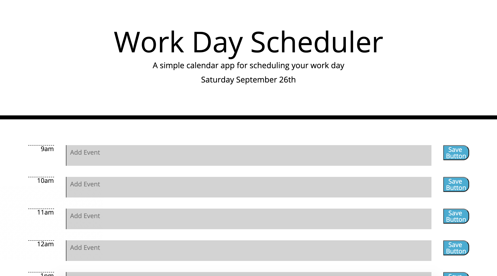
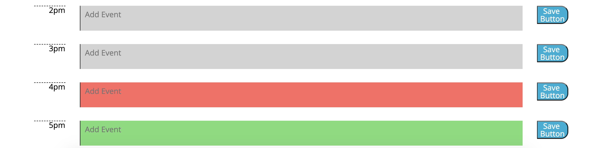
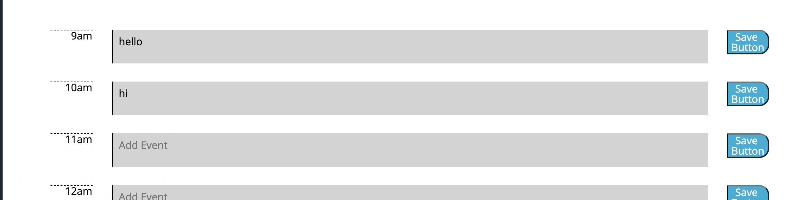

# week5-homework

The Work Day Scheduler allows the user to keep track of the event happening within their day.

Link to deployed application:
https://grahamelphick.github.io/work-day-scheduler/

Screenshots of deployed application:

When the user opens the planner, the current day is displayed at the top of the calendar.

As the user scrolls down they are presented with timeblocks for standard business hours: 9am-5pm.

The timeblocks are colour-coded to indicate whether they are in the past, present or future.

Upon clicking a timeblock, the user can enter an event.

Clicking the save button for each timeblock will save it's respective event to local storage. If the page is refreshed, the user will still see the entered events.